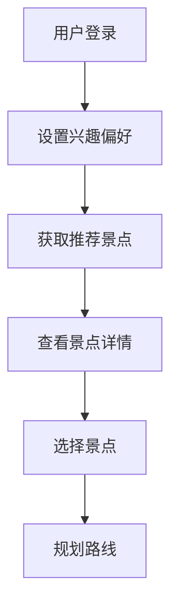
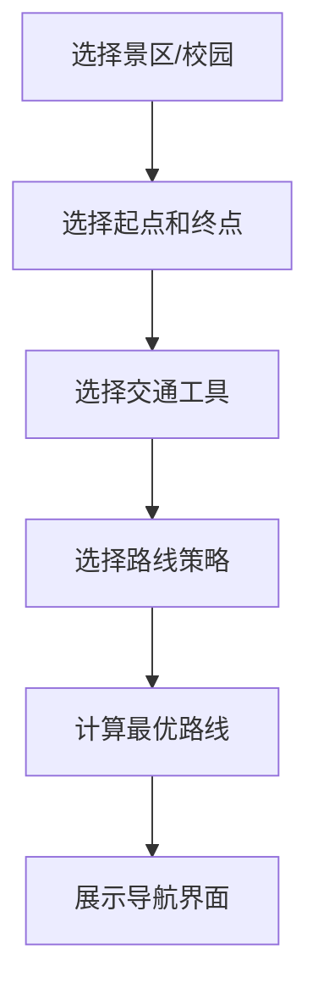
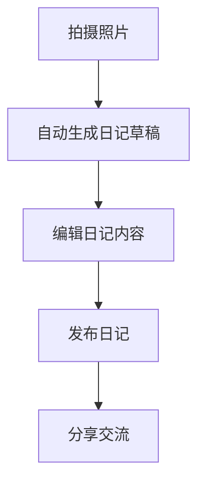

# 个性化旅游推荐系统需求规格说明书

## 1. 项目概述
### 1.1 项目背景
随着人们生活水平的提高，旅游已经成为人们休闲娱乐的重要方式。然而，面对众多的旅游景点和旅游信息，用户往往难以选择适合自己的旅游目的地，也难以在旅游过程中规划最优的参观线路。个性化旅游系统旨在帮助用户管理旅游活动，提供个性化的旅游推荐和线路规划服务，提升用户的旅游体验。

### 1.2 项目目标
开发一个个性化旅游系统，具备旅游地点推荐、旅游路线规划、旅游场所查询、旅游日记交流等功能，满足用户在旅游前、旅游中和旅游后的各种需求。

### 1.3 目标用户
| 角色 | 描述 | 核心职责 |
|------|------|----------|
| 普通用户 | 旅游爱好者 | 浏览推荐、规划路线、查询场所、撰写日记、分享交流 |
| 管理员 | 系统维护者 | 管理用户、景区信息、道路图、美食信息、数据备份 |

### 1.4 项目范围
本项目专注于个性化旅游服务，包括旅游目的地推荐、景区内线路规划、场所查询、旅游日记管理和美食推荐等功能。系统将覆盖景区和校园等多种旅游场景。

## 2. 功能需求
### 2.1 旅游前功能
#### 2.1.1 功能列表
| 功能编号 | 功能名称 | 优先级 | 描述 | 验收标准 |
|----------|----------|--------|------|----------|
| FR-001 | 旅游目的地推荐 | 高 | 根据旅游目的地的热度、评价和个人兴趣，为用户推荐合适的旅游目的地。个人兴趣类型包括：自然风光、历史文化、主题乐园、美食、购物、休闲娱乐等。系统通过用户兴趣与景点标签的匹配度进行量化计算。 | 系统能够根据热度、评价和个人兴趣推荐旅游目的地 |
| FR-002 | 目的地信息查询 | 高 | 提供旅游目的地的详细信息，包括景点介绍、开放时间、门票价格、交通信息、最佳游览时间、联系方式等。 | 系统能够提供旅游目的地的详细信息 |
| FR-003 | 个人兴趣设置 | 中 | 用户可以设置个人兴趣偏好，系统根据偏好进行推荐。用户可以选择多个兴趣类型，并设置各兴趣类型的权重。 | 用户能够设置个人兴趣偏好，系统根据偏好进行推荐 |

### 2.2 旅游中功能
#### 2.2.1 旅游路线规划
| 功能编号 | 功能名称 | 优先级 | 描述 | 验收标准 |
|----------|----------|--------|------|----------|
| FR-004 | 最优参观线路规划 | 高 | 在景区（包括校园）内部根据游览目标规划最优的参观线路。最优线路的评价标准包括：距离最短、时间最短、景点覆盖最多等，用户可以选择优先考虑的因素。 | 系统能够在景区内部规划最优的参观线路 |
| FR-004-1 | 最短距离策略 | 高 | 规划距离最短的线路 | 系统能够实现最短距离策略的线路规划 |
| FR-004-2 | 最短时间策略 | 高 | 考虑道路拥挤度的情况下规划时间最短的线路，拥挤度为小于等于1的正数，真实速度=拥挤度*理想速度。拥挤度数据为模拟数据，根据时间段和历史数据进行预设。 | 系统能够实现考虑道路拥挤度的最短时间策略 |
| FR-004-3 | 交通工具的最短时间策略 | 中 | 校区内可选择自行车和步行，景区内可选择步行和电瓶车，不同交通工具只能走对应路线，可混合使用多种交通工具。步行速度为4km/h，自行车速度为12km/h，电瓶车速度为20km/h。 | 系统能够实现不同交通工具的最短时间策略 |
| FR-004-4 | 导航功能的图形界面 | 中 | 设计包括地图展示和输出路径展示的导航界面。地图数据使用离线地图包，支持基本的导航功能。 | 系统能够展示导航功能的图形界面 |

#### 2.2.2 场所查询
| 功能编号 | 功能名称 | 优先级 | 描述 | 验收标准 |
|----------|----------|--------|------|----------|
| FR-005 | 景点介绍 | 高 | 提供景区内各个景点的详细介绍和相关信息 | 系统能够提供景点的详细介绍 |
| FR-006 | 场所查询 | 高 | 提供景区内各种服务设施的查询功能，如商店、饭店、洗手间等 | 系统能够查询景区内的各种服务设施 |
| FR-006-1 | 附近设施查找 | 高 | 找出附近500米范围内的超市、卫生间等设施，并根据实际可达路径距离进行排序。用户可以调整搜索范围（200米、500米、1000米）。 | 系统能够找出附近设施并根据实际可达路径距离排序 |
| FR-006-2 | 类别过滤 | 中 | 通过选择类别对查询结果进行过滤 | 系统能够通过类别过滤查询结果 |
| FR-006-3 | 类别名称查询 | 中 | 用户输入类别名称查找某个地点附近的服务设施，并根据实际可达路径距离进行排序。类别名称支持模糊匹配，系统会返回相似度高的结果。 | 系统能够根据类别名称查找附近服务设施 |

#### 2.2.3 美食推荐
| 功能编号 | 功能名称 | 优先级 | 描述 | 验收标准 |
|----------|----------|--------|------|----------|
| FR-013 | 美食推荐 | 高 | 在选中游览景点和学校后，推荐附近1000米范围内的美食。系统会考虑用户的饮食偏好（如辣度、口味等）。 | 系统能够推荐附近的美食 |
| FR-013-1 | 美食排序 | 高 | 按照用户选择的热度、评价和距离进行排序，要求不经过完全排序可以排好前10的美食。热度、评价和距离的权重默认分别为0.3、0.5、0.2，用户可以调整权重。 | 系统能够按照热度、评价和距离排序美食，不经过完全排序可以排好前10的美食 |
| FR-013-2 | 菜系过滤 | 中 | 根据菜系进行过滤 | 系统能够根据菜系过滤美食 |
| FR-013-3 | 模糊查询 | 中 | 输入美食名称、菜系、饭店或窗口名称等进行基于内容的模糊查询，支持部分匹配和同义词。 | 系统能够进行基于内容的模糊查询 |
| FR-013-4 | 查询结果排序 | 中 | 对查询结果按照热度、评价和距离进行排序 | 系统能够对查询结果按照热度、评价和距离排序 |

### 2.3 旅游后功能
#### 2.3.1 旅游日记管理
| 功能编号 | 功能名称 | 优先级 | 描述 | 验收标准 |
|----------|----------|--------|------|----------|
| FR-007 | 旅游日记生成 | 中 | 根据用户拍摄的照片和游览经历自动生成日记。系统会根据照片的时间和位置信息，结合用户的游览路径，生成包含照片、地点和时间的日记草稿。 | 系统能够根据用户拍摄的照片和游览经历生成旅游日记 |
| FR-008 | 旅游日记管理 | 高 | 用户可以查看、编辑和管理自己的旅游日记 | 用户能够查看、编辑和管理自己的旅游日记 |
| FR-008-1 | 日记撰写 | 高 | 用户可以通过文字、图片和视频等方式记录旅游内容。支持的图片格式包括JPG、PNG，视频格式包括MP4，单文件大小限制为10MB。 | 用户能够通过文字、图片和视频撰写日记 |
| FR-008-2 | 统一管理 | 中 | 对所有用户的旅游日记进行统一管理 | 系统能够对所有用户的旅游日记进行统一管理 |
| FR-008-3 | 日记浏览和查询 | 高 | 用户可以浏览和查询所有用户的旅游日记 | 用户能够浏览和查询所有用户的旅游日记 |
| FR-008-4 | 日记热度计算 | 中 | 旅游日记的浏览量即为该日记的热度，近期（7天内）的浏览量权重为1.5。 | 系统能够计算旅游日记的热度 |
| FR-008-5 | 日记评分 | 中 | 用户可以对旅游日记进行评分（1-5星） | 用户能够对旅游日记进行评分 |
| FR-008-6 | 日记推荐 | 中 | 按照日记热度、评价和个人兴趣进行推荐，推荐算法基础为排序算法 | 系统能够按照热度、评价和个人兴趣推荐日记 |

#### 2.3.2 旅游日记交流
| 功能编号 | 功能名称 | 优先级 | 描述 | 验收标准 |
|----------|----------|--------|------|----------|
| FR-009 | 旅游日记交流 | 高 | 用户可以分享和交流旅游日记，查看其他用户的旅游经历 | 用户能够分享和交流旅游日记 |
| FR-009-1 | 目的地相关日记查询 | 中 | 用户可以输入旅游目的地，对目的地相关的旅游日记根据热度和评分进行排序。相关性判断基于日记标题、内容和标签与目的地的匹配度。 | 用户能够查询目的地相关的旅游日记并排序 |
| FR-009-2 | 日记名称精确查询 | 中 | 用户可以输入旅游日记的名称进行精确查询，考虑日记数量较大、变化快的情况 | 用户能够通过名称精确查询旅游日记 |
| FR-009-3 | 全文检索 | 中 | 可以按日记内容进行全文检索 | 系统能够按日记内容进行全文检索 |
| FR-009-4 | 压缩存储 | 低 | 对旅游日记进行压缩存储 | 系统能够对旅游日记进行压缩存储 |
| FR-009-5 | 旅游动画生成 | 低 | 使用AIGC算法根据拍摄的景点或学校的照片、文字描述等信息生成旅游动画。系统使用开源的AIGC库实现，不需要外部API。 | 系统能够使用AIGC算法生成旅游动画 |

### 2.4 系统管理功能
| 功能编号 | 功能名称 | 优先级 | 描述 | 验收标准 |
|----------|----------|--------|------|----------|
| FR-010 | 用户管理 | 高 | 管理系统用户信息，支持用户注册、登录等功能。用户角色包括普通用户和管理员，管理员具有系统配置和数据管理权限。 | 系统能够管理用户信息，支持用户注册、登录等功能 |
| FR-011 | 景区信息管理 | 高 | 管理景区和校园的基本信息，包括景点、建筑物和服务设施等 | 系统能够管理景区和校园的基本信息 |
| FR-012 | 道路图管理 | 高 | 管理景区和校园内部的道路图，包括建筑物和服务设施的位置信息 | 系统能够管理景区和校园内部的道路图 |
| FR-014 | 美食信息管理 | 中 | 管理景区和校园内的美食信息，包括名称、菜系、评价等 | 系统能够管理美食信息 |
| FR-015 | 系统通知 | 低 | 系统向用户发送推荐更新、活动通知等信息 | 系统能够向用户发送推荐更新、活动通知等信息 |
| FR-016 | 数据备份与恢复 | 高 | 定期备份系统数据，并提供数据恢复功能 | 系统能够定期备份数据，并提供数据恢复功能 |

## 3. 非功能需求
### 3.1 性能需求
- 系统响应时间应在3秒以内
- 线路规划算法计算时间应在2秒以内
- 全文检索响应时间应在1秒以内

### 3.2 安全需求
- 系统应实现数据加密存储
- 防止SQL注入和XSS攻击
- 保护用户隐私

### 3.3 可用性需求
- 界面设计应简洁美观
- 操作流程应直观易用
- 支持响应式设计，适配不同设备屏幕

### 3.4 兼容性需求
- 系统应兼容主流浏览器（Chrome、Firefox、Safari、Edge）
- 系统应兼容移动设备（iOS、Android）

### 3.5 可扩展性需求
- 系统应支持后续功能扩展和数据量增长
- 采用模块化设计，便于添加新功能

### 3.6 可维护性需求
- 代码应采用模块化设计，遵循编码规范
- 提供详细的文档和注释

### 3.7 可测试性需求
- 系统应提供完整的测试用例
- 支持单元测试和集成测试

### 3.8 创新性需求
- 系统的创新点体现在：1）结合多种排序算法实现高效的旅游推荐；2）使用图结构实现景区内最优路径规划；3）基于用户行为的个性化推荐；4）AIGC技术生成旅游动画。

### 3.9 算法要求
- 核心算法必须基于自己设计的数据结构，自己编程实现

### 3.10 系统要求
- 要求最终提供真实可用的系统

## 4. 业务流程图
### 4.1 旅游推荐流程

### 4.2 路线规划流程

### 4.3 旅游日记流程

## 5. 数据需求
### 5.1 数据实体
| 实体名称 | 描述 |
|---------|------|
| 用户 | 系统用户，包含基本信息和兴趣偏好 |
| 景区/校园 | 旅游目的地，包含基本信息和位置 |
| 建筑物 | 景区和校园内的建筑，如景点、教学楼、办公楼等 |
| 服务设施 | 景区和校园内的服务设施，如商店、饭店、洗手间等 |
| 道路图 | 景区和校园内部的道路网络，包含道路拥挤度和理想速度 |
| 旅游日记 | 用户的旅游记录，包含照片、视频和文字描述 |
| 评价 | 用户对景点、服务和旅游日记的评价 |
| 交通工具 | 可用的交通工具类型和对应路线 |
| 美食 | 景区和校园内的美食信息，包含名称、菜系、评价等 |
| 饭店/窗口 | 提供美食的场所，包含名称、位置等信息 |

### 5.2 数据字典
| 实体 | 字段 | 类型 | 描述 |
|------|------|------|------|
| 用户 | id | BIGINT | 用户ID |
| 用户 | username | VARCHAR | 用户名 |
| 用户 | password | VARCHAR | 密码（加密存储） |
| 用户 | email | VARCHAR | 邮箱 |
| 景区/校园 | id | BIGINT | 景区ID |
| 景区/校园 | name | VARCHAR | 景区名称 |
| 景区/校园 | type | VARCHAR | 景区类型（普通景区、校园等） |
| 建筑物 | id | BIGINT | 建筑物ID |
| 建筑物 | name | VARCHAR | 建筑物名称 |
| 建筑物 | type | VARCHAR | 建筑物类型（景点、教学楼等） |
| 道路 | id | BIGINT | 道路ID |
| 道路 | start_id | BIGINT | 起点ID（建筑物或设施） |
| 道路 | end_id | BIGINT | 终点ID（建筑物或设施） |
| 美食 | id | BIGINT | 美食ID |
| 美食 | name | VARCHAR | 美食名称 |
| 美食 | cuisine | VARCHAR | 菜系 |
| 日记 | id | BIGINT | 日记ID |
| 日记 | title | VARCHAR | 日记标题 |
| 日记 | content | TEXT | 日记内容 |

### 5.3 数据规模要求
| 数据类型 | 规模要求 |
|---------|----------|
| 景区和校园数量 | 至少200个（最低要求），系统应支持1000个以上的扩展 |
| 建筑物数量 | 每个景区和校园不少于20个 |
| 服务设施种类 | 不少于10种 |
| 服务设施数量 | 不少于50个 |
| 道路图边数 | 不少于200条 |
| 系统用户数 | 不少于10人（最低要求），系统应支持10000个以上的用户 |

### 5.4 数据关系
- 用户与旅游日记：一对多关系，一个用户可以创建多个旅游日记
- 用户与评价：一对多关系，一个用户可以发表多条评价
- 景区/校园与建筑物：一对多关系，一个景区/校园包含多个建筑物
- 景区/校园与服务设施：一对多关系，一个景区/校园包含多个服务设施
- 景区/校园与道路图：一对一关系，一个景区/校园对应一个道路图
- 道路图与建筑物：多对多关系，道路图包含多个建筑物，建筑物位于道路图中
- 道路图与服务设施：多对多关系，道路图包含多个服务设施，服务设施位于道路图中
- 景区/校园与交通工具：一对多关系，一个景区/校园支持多种交通工具
- 景区/校园与美食：一对多关系，一个景区/校园包含多个美食
- 景区/校园与饭店/窗口：一对多关系，一个景区/校园包含多个饭店/窗口
- 饭店/窗口与美食：一对多关系，一个饭店/窗口提供多种美食
- 用户与美食：多对多关系，用户可以对多个美食进行评价
- 旅游日记与目的地：多对多关系，一个日记可以关联多个目的地，一个目的地可以关联多个日记

## 6. 接口需求
### 6.1 外部接口
- 无外部API依赖

### 6.2 内部接口
| API路径 | 方法 | 功能描述 |
|---------|------|----------|
| /api/auth/* | POST | 用户认证相关接口 |
| /api/recommendation/* | GET | 旅游推荐相关接口 |
| /api/route/* | POST | 路线规划相关接口 |
| /api/facility/* | GET | 场所查询相关接口 |
| /api/food/* | GET | 美食推荐相关接口 |
| /api/diary/* | POST/GET | 旅游日记相关接口 |
| /api/admin/* | POST/GET | 系统管理相关接口 |

## 7. 约束与假设
### 7.1 技术约束
- 核心算法必须基于自己设计的数据结构，自己编程实现
- 系统支持中文语言，暂不支持多语言国际化

## 7. 风险/依赖备注

| 类型 | 关联编号/功能点 | 具体内容/说明 | 备注 |
|------|----------------|--------------|------|
| 风险 | FR-004 | 最优参观线路规划算法的准确性和效率 | 需设计高效的路径规划算法 |
| 风险 | FR-004-2 | 道路拥挤度的模拟和计算 | 需合理模拟道路拥挤度数据 |
| 风险 | FR-004-3 | 不同交通工具路线的管理和计算 | 需建立交通工具路线数据 |
| 风险 | FR-006-1 | 实际可达路径距离的计算 | 需考虑复杂的道路网络 |
| 风险 | FR-008-6 | 旅游日记推荐的准确性 | 需设计有效的排序算法 |
| 风险 | FR-009-3 | 全文检索的效率 | 需设计高效的文本搜索算法 |
| 风险 | FR-009-5 | AIGC算法的实现和效果 | 需考虑算法的复杂度和效果 |
| 风险 | FR-013-1 | 美食排序的效率和准确性 | 需设计高效的排序算法，特别是前10名的选择 |
| 风险 | FR-013-3 | 模糊查询的准确性和效率 | 需设计高效的模糊查找算法 |
| 依赖 | FR-011 | 景区和校园信息的完整性和准确性 | 需建立可靠的信息采集机制 |
| 依赖 | FR-012 | 道路图数据的质量和完整性 | 建议爬取真实地图数据 |
| 依赖 | FR-014 | 美食信息的完整性和准确性 | 需建立可靠的美食信息采集机制 |
| 风险 | 数据规模 | 数据量较大可能影响系统性能 | 需考虑数据存储和查询优化 |
| 依赖 | FR-001 | 个性化推荐的准确性 | 需积累足够的用户数据和偏好信息 |
| 风险 | FR-016 | 数据备份与恢复的可靠性 | 需建立完善的备份策略和测试机制 |

## 8. 验收标准

| 需求编号 | 验收标准 |
|---------|----------|
| FR-001 | 系统能够根据热度、评价和个人兴趣推荐旅游目的地 |
| FR-002 | 系统能够提供旅游目的地的详细信息 |
| FR-003 | 用户能够设置个人兴趣偏好，系统根据偏好进行推荐 |
| FR-004 | 系统能够在景区内部规划最优的参观线路 |
| FR-004-1 | 系统能够实现最短距离策略的线路规划 |
| FR-004-2 | 系统能够实现考虑道路拥挤度的最短时间策略 |
| FR-004-3 | 系统能够实现不同交通工具的最短时间策略 |
| FR-004-4 | 系统能够展示导航功能的图形界面 |
| FR-005 | 系统能够提供景点的详细介绍 |
| FR-006 | 系统能够查询景区内的各种服务设施 |
| FR-006-1 | 系统能够找出附近设施并根据实际可达路径距离排序 |
| FR-006-2 | 系统能够通过类别过滤查询结果 |
| FR-006-3 | 系统能够根据类别名称查找附近服务设施 |
| FR-007 | 系统能够根据用户拍摄的照片和游览经历生成旅游日记 |
| FR-008 | 用户能够查看、编辑和管理自己的旅游日记 |
| FR-008-1 | 用户能够通过文字、图片和视频撰写日记 |
| FR-008-2 | 系统能够对所有用户的旅游日记进行统一管理 |
| FR-008-3 | 用户能够浏览和查询所有用户的旅游日记 |
| FR-008-4 | 系统能够计算旅游日记的热度 |
| FR-008-5 | 用户能够对旅游日记进行评分 |
| FR-008-6 | 系统能够按照热度、评价和个人兴趣推荐日记 |
| FR-009 | 用户能够分享和交流旅游日记 |
| FR-009-1 | 用户能够查询目的地相关的旅游日记并排序 |
| FR-009-2 | 用户能够通过名称精确查询旅游日记 |
| FR-009-3 | 系统能够按日记内容进行全文检索 |
| FR-009-4 | 系统能够对旅游日记进行压缩存储 |
| FR-009-5 | 系统能够使用AIGC算法生成旅游动画 |
| FR-010 | 系统能够管理用户信息，支持用户注册、登录等功能 |
| FR-011 | 系统能够管理景区和校园的基本信息 |
| FR-012 | 系统能够管理景区和校园内部的道路图 |
| FR-013 | 系统能够推荐附近的美食 |
| FR-013-1 | 系统能够按照热度、评价和距离排序美食，不经过完全排序可以排好前10的美食 |
| FR-013-2 | 系统能够根据菜系过滤美食 |
| FR-013-3 | 系统能够进行基于内容的模糊查询 |
| FR-013-4 | 系统能够对查询结果按照热度、评价和距离排序 |
| FR-014 | 系统能够管理美食信息 |
| FR-015 | 系统能够向用户发送推荐更新、活动通知等信息 |
| FR-016 | 系统能够定期备份数据，并提供数据恢复功能 |
| NFR-001 | 系统响应时间在3秒以内，线路规划算法计算时间在2秒以内，全文检索响应时间在1秒以内 |
| NFR-002 | 界面设计简洁美观，操作流程直观易用，支持响应式设计 |
| NFR-003 | 系统支持后续功能扩展和数据量增长 |
| NFR-004 | 系统保证数据的一致性和完整性，数据丢失率低于0.1% |
| NFR-005 | 系统在主流浏览器和移动设备上正常运行 |
| NFR-006 | 系统实现了创新性功能，包括多种排序算法的应用、图结构的路径规划、个性化推荐和AIGC动画生成 |
| NFR-007 | 核心算法基于自己设计的数据结构，自己编程实现 |
| NFR-008 | 提供真实可用的系统 |
| NFR-009 | 系统实现了数据加密存储，防止SQL注入和XSS攻击 |
| NFR-010 | 代码采用模块化设计，遵循编码规范，提供详细的文档和注释 |
| NFR-011 | 系统提供完整的测试用例，支持单元测试和集成测试 |
| 数据规模 | 满足景区、建筑物、服务设施、道路图和用户的数量要求 |
---

**文档作者**：资深项目经理
**文档版本**：1.2
**创建日期**：2026-03-09
**最后更新**：2026-03-09