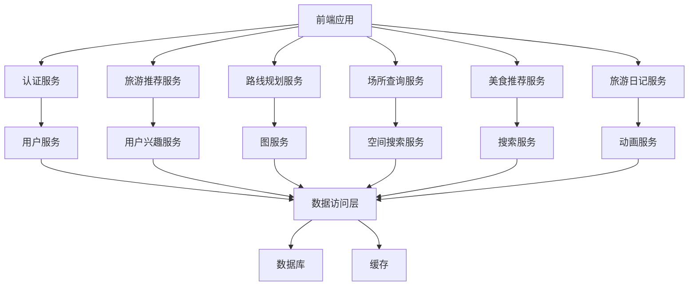
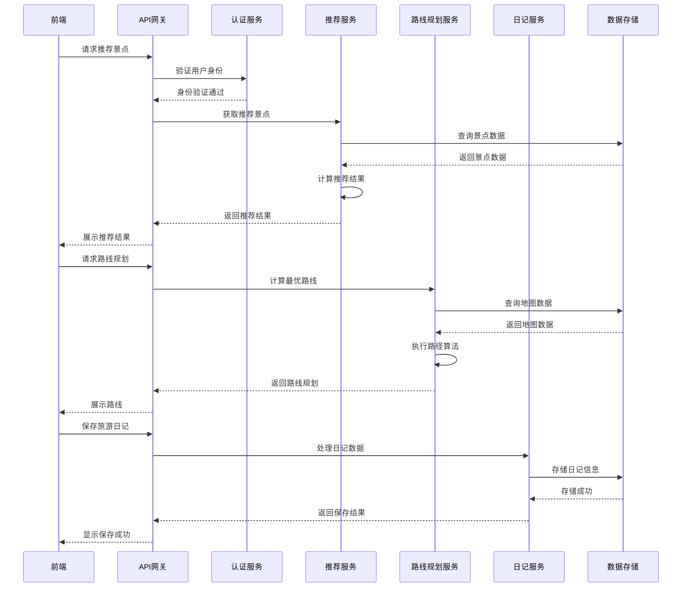

# 个性化旅游推荐系统技术设计文档

## 1. 系统架构设计

### 1.1 架构风格
采用前后端分离的三层架构：
- **前端层**：负责用户界面展示和交互
- **后端层**：负责业务逻辑处理和数据处理
- **数据层**：负责数据存储和管理

### 1.2 系统模块划分

| 模块名称 | 职责描述 | 所属层次 |
|---------|---------|----------|
| 前端应用 | 用户界面展示、交互处理 | 前端层 |
| 控制器层 | 请求处理、路由管理 | 后端层 |
| 服务层 | 业务逻辑处理 | 后端层 |
| 数据访问层 | 数据库操作 | 数据层 |
| 数据存储 | 数据持久化、缓存管理 | 数据层 |

### 1.3 模块依赖关系



### 1.4 核心流程图



## 2. 技术栈选择

### 2.1 前端技术

| 技术         | 版本  | 用途               | 选型理由                                       |
| ------------ | ----- | ------------------ | ---------------------------------------------- |
| Vue.js       | 3.x   | 前端框架           | 响应式设计，组件化开发，适合构建复杂的用户界面 |
| Vue Router   | 4.x   | 路由管理           | 前端路由控制，实现单页应用                     |
| Pinia        | 2.x   | 状态管理           | 轻量级状态管理，替代Vuex                       |
| Axios        | 1.x   | 网络请求           | 处理HTTP请求，与后端API通信                    |
| Element Plus | 2.x   | UI组件库           | 提供丰富的UI组件，加速开发                     |
| Leaflet      | 1.9.x | 地图库             | 轻量级开源地图库，支持离线地图                 |
| ECharts      | 5.x   | 数据可视化（可选） | 用于热度分析、数据统计等可视化展示             |

### 2.2 后端技术

| 技术         | 版本  | 用途         | 选型理由                         |
| ------------ | ----- | ------------ | -------------------------------- |
| Java         | 11    | 开发语言     | 成熟稳定，适合企业级应用开发     |
| Spring Boot  | 2.7.x | 应用框架     | 简化后端开发，提供丰富的生态     |
| MyBatis-Plus | 3.5.x | ORM框架      | 简化数据库操作，提供代码生成     |
| MySQL        | 8.0   | 关系型数据库 | 成熟稳定，适合存储结构化数据     |
| Redis        | 7.0+  | 缓存（可选） | 提高数据访问速度，减轻数据库压力 |

### 2.3 数据结构与算法

| 数据结构/算法 | 用途         | 选型理由                       |
| ------------- | ------------ | ------------------------------ |
| 图结构        | 道路网络建模 | 适合表示景点和道路之间的关系   |
| 优先队列      | 路径规划     | 用于Dijkstra算法实现最短路径   |
| 哈希表        | 快速查询     | 用于用户、景点等信息的快速检索 |
| 前缀树        | 模糊查询     | 用于美食、景点名称的模糊搜索   |
| 排序算法      | 推荐排序     | 用于景点、美食、日记的排序     |
| Dijkstra算法  | 最短路径     | 用于路线规划中的最短距离计算   |
| A*算法        | 路径规划     | 用于更高效的路径搜索           |
| 协同过滤      | 推荐算法     | 基于用户行为的个性化推荐       |

### 2.4 开发工具

| 工具          | 用途     | 选型理由                     |
| ------------- | -------- | ---------------------------- |
| IntelliJ IDEA | 后端开发 | 功能强大的Java IDE           |
| VS Code       | 前端开发 | 轻量级编辑器，丰富的插件生态 |
| Git           | 版本控制 | 代码管理和协作               |
| Maven         | 依赖管理 | 管理Java项目依赖             |
| npm           | 包管理   | 管理前端项目依赖             |
| Jenkins       | 持续集成 | 自动化构建和部署             |

## 3. 数据库设计

### 3.1 详细数据表结构

#### 3.1.1 用户表（users）
| 字段名      | 数据类型 | 长度 | 约束                                                         | 描述             |
| ----------- | -------- | ---- | ------------------------------------------------------------ | ---------------- |
| id          | BIGINT   | 20   | PRIMARY KEY, AUTO_INCREMENT                                  | 用户ID           |
| username    | VARCHAR  | 50   | UNIQUE, NOT NULL                                             | 用户名           |
| password    | VARCHAR  | 100  | NOT NULL                                                     | 密码（加密存储） |
| email       | VARCHAR  | 100  | UNIQUE, NOT NULL                                             | 邮箱             |
| nickname    | VARCHAR  | 50   | NOT NULL                                                     | 昵称             |
| avatar      | VARCHAR  | 255  |                                                              | 头像URL          |
| create_time | DATETIME |      | NOT NULL, DEFAULT CURRENT_TIMESTAMP                          | 创建时间         |
| update_time | DATETIME |      | NOT NULL, DEFAULT CURRENT_TIMESTAMP ON UPDATE CURRENT_TIMESTAMP | 更新时间         |

#### 3.1.2 用户兴趣表（user_interests）
| 字段名        | 数据类型 | 长度 | 约束                                | 描述                             |
| ------------- | -------- | ---- | ----------------------------------- | -------------------------------- |
| id            | BIGINT   | 20   | PRIMARY KEY, AUTO_INCREMENT         | 主键ID                           |
| user_id       | BIGINT   | 20   | NOT NULL                            | 用户ID                           |
| interest_type | VARCHAR  | 50   | NOT NULL                            | 兴趣类型（自然风光、历史文化等） |
| weight        | DOUBLE   |      | NOT NULL, DEFAULT 1.0               | 兴趣权重                         |
| create_time   | DATETIME |      | NOT NULL, DEFAULT CURRENT_TIMESTAMP | 创建时间                         |

#### 3.1.3 景区表（scenic_areas）
| 字段名       | 数据类型 | 长度 | 约束                                                         | 描述                         |
| ------------ | -------- | ---- | ------------------------------------------------------------ | ---------------------------- |
| id           | BIGINT   | 20   | PRIMARY KEY, AUTO_INCREMENT                                  | 景区ID                       |
| name         | VARCHAR  | 100  | NOT NULL                                                     | 景区名称                     |
| description  | TEXT     |      |                                                              | 景区描述                     |
| location     | VARCHAR  | 255  | NOT NULL                                                     | 位置信息                     |
| longitude    | DOUBLE   |      | NOT NULL                                                     | 经度                         |
| latitude     | DOUBLE   |      | NOT NULL                                                     | 纬度                         |
| type         | VARCHAR  | 50   | NOT NULL                                                     | 景区类型（普通景区、校园等） |
| rating       | DOUBLE   |      | DEFAULT 0.0                                                  | 评分                         |
| heat         | INT      |      | DEFAULT 0                                                    | 热度                         |
| open_time    | VARCHAR  | 100  |                                                              | 开放时间                     |
| ticket_price | VARCHAR  | 100  |                                                              | 门票价格                     |
| create_time  | DATETIME |      | NOT NULL, DEFAULT CURRENT_TIMESTAMP                          | 创建时间                     |
| update_time  | DATETIME |      | NOT NULL, DEFAULT CURRENT_TIMESTAMP ON UPDATE CURRENT_TIMESTAMP | 更新时间                     |

#### 3.1.5 建筑物表（buildings）
| 字段名      | 数据类型 | 长度 | 约束                                                         | 描述                         |
| ----------- | -------- | ---- | ------------------------------------------------------------ | ---------------------------- |
| id          | BIGINT   | 20   | PRIMARY KEY, AUTO_INCREMENT                                  | 建筑物ID                     |
| name        | VARCHAR  | 100  | NOT NULL                                                     | 建筑物名称                   |
| type        | VARCHAR  | 50   | NOT NULL                                                     | 建筑物类型（景点、教学楼等） |
| description | TEXT     |      |                                                              | 建筑物描述                   |
| location    | VARCHAR  | 255  | NOT NULL                                                     | 位置信息                     |
| longitude   | DOUBLE   |      | NOT NULL                                                     | 经度                         |
| latitude    | DOUBLE   |      | NOT NULL                                                     | 纬度                         |
| parent_id   | BIGINT   | 20   |                                                              | 父建筑物ID（用于室内导航）   |
| area_id     | BIGINT   | 20   | NOT NULL                                                     | 所属景区ID                   |
| create_time | DATETIME |      | NOT NULL, DEFAULT CURRENT_TIMESTAMP                          | 创建时间                     |
| update_time | DATETIME |      | NOT NULL, DEFAULT CURRENT_TIMESTAMP ON UPDATE CURRENT_TIMESTAMP | 更新时间                     |

#### 3.1.6 服务设施表（facilities）
| 字段名      | 数据类型 | 长度 | 约束                                                         | 描述                       |
| ----------- | -------- | ---- | ------------------------------------------------------------ | -------------------------- |
| id          | BIGINT   | 20   | PRIMARY KEY, AUTO_INCREMENT                                  | 设施ID                     |
| name        | VARCHAR  | 100  | NOT NULL                                                     | 设施名称                   |
| type        | VARCHAR  | 50   | NOT NULL                                                     | 设施类型（洗手间、餐厅等） |
| description | TEXT     |      |                                                              | 设施描述                   |
| location    | VARCHAR  | 255  | NOT NULL                                                     | 位置信息                   |
| longitude   | DOUBLE   |      | NOT NULL                                                     | 经度                       |
| latitude    | DOUBLE   |      | NOT NULL                                                     | 纬度                       |
| area_id     | BIGINT   | 20   | NOT NULL                                                     | 所属景区ID                 |
| create_time | DATETIME |      | NOT NULL, DEFAULT CURRENT_TIMESTAMP                          | 创建时间                   |
| update_time | DATETIME |      | NOT NULL, DEFAULT CURRENT_TIMESTAMP ON UPDATE CURRENT_TIMESTAMP | 更新时间                   |

#### 3.1.7 道路表（roads）
| 字段名       | 数据类型 | 长度 | 约束                                                         | 描述                   |
| ------------ | -------- | ---- | ------------------------------------------------------------ | ---------------------- |
| id           | BIGINT   | 20   | PRIMARY KEY, AUTO_INCREMENT                                  | 道路ID                 |
| start_id     | BIGINT   | 20   | NOT NULL                                                     | 起点ID（建筑物或设施） |
| end_id       | BIGINT   | 20   | NOT NULL                                                     | 终点ID（建筑物或设施） |
| distance     | DOUBLE   |      | NOT NULL                                                     | 距离（米）             |
| speed        | DOUBLE   |      | NOT NULL, DEFAULT 5.0                                        | 理想速度（米/秒）      |
| congestion   | DOUBLE   |      | NOT NULL, DEFAULT 1.0                                        | 拥挤度（0-1）          |
| vehicle_type | VARCHAR  | 50   |                                                              | 允许的交通工具类型     |
| create_time  | DATETIME |      | NOT NULL, DEFAULT CURRENT_TIMESTAMP                          | 创建时间               |
| update_time  | DATETIME |      | NOT NULL, DEFAULT CURRENT_TIMESTAMP ON UPDATE CURRENT_TIMESTAMP | 更新时间               |

#### 3.1.8 美食表（foods）
| 字段名        | 数据类型 | 长度 | 约束                                                         | 描述       |
| ------------- | -------- | ---- | ------------------------------------------------------------ | ---------- |
| id            | BIGINT   | 20   | PRIMARY KEY, AUTO_INCREMENT                                  | 美食ID     |
| name          | VARCHAR  | 100  | NOT NULL                                                     | 美食名称   |
| cuisine       | VARCHAR  | 50   | NOT NULL                                                     | 菜系       |
| description   | TEXT     |      |                                                              | 美食描述   |
| price         | DECIMAL  | 10,2 |                                                              | 价格       |
| rating        | DOUBLE   |      | DEFAULT 0.0                                                  | 评分       |
| heat          | INT      |      | DEFAULT 0                                                    | 热度       |
| restaurant_id | BIGINT   | 20   | NOT NULL                                                     | 所属饭店ID |
| area_id       | BIGINT   | 20   | NOT NULL                                                     | 所属景区ID |
| create_time   | DATETIME |      | NOT NULL, DEFAULT CURRENT_TIMESTAMP                          | 创建时间   |
| update_time   | DATETIME |      | NOT NULL, DEFAULT CURRENT_TIMESTAMP ON UPDATE CURRENT_TIMESTAMP | 更新时间   |

#### 3.1.9 饭店表（restaurants）
| 字段名      | 数据类型 | 长度 | 约束                                                         | 描述       |
| ----------- | -------- | ---- | ------------------------------------------------------------ | ---------- |
| id          | BIGINT   | 20   | PRIMARY KEY, AUTO_INCREMENT                                  | 饭店ID     |
| name        | VARCHAR  | 100  | NOT NULL                                                     | 饭店名称   |
| description | TEXT     |      |                                                              | 饭店描述   |
| location    | VARCHAR  | 255  | NOT NULL                                                     | 位置信息   |
| longitude   | DOUBLE   |      | NOT NULL                                                     | 经度       |
| latitude    | DOUBLE   |      | NOT NULL                                                     | 纬度       |
| area_id     | BIGINT   | 20   | NOT NULL                                                     | 所属景区ID |
| create_time | DATETIME |      | NOT NULL, DEFAULT CURRENT_TIMESTAMP                          | 创建时间   |
| update_time | DATETIME |      | NOT NULL, DEFAULT CURRENT_TIMESTAMP ON UPDATE CURRENT_TIMESTAMP | 更新时间   |

#### 3.1.10 旅游日记表（diaries）
| 字段名      | 数据类型 | 长度 | 约束                                                         | 描述                |
| ----------- | -------- | ---- | ------------------------------------------------------------ | ------------------- |
| id          | BIGINT   | 20   | PRIMARY KEY, AUTO_INCREMENT                                  | 日记ID              |
| user_id     | BIGINT   | 20   | NOT NULL                                                     | 用户ID              |
| title       | VARCHAR  | 200  | NOT NULL                                                     | 日记标题            |
| content     | TEXT     |      | NOT NULL                                                     | 日记内容            |
| images      | TEXT     |      |                                                              | 图片URL（JSON格式） |
| videos      | TEXT     |      |                                                              | 视频URL（JSON格式） |
| heat        | INT      |      | DEFAULT 0                                                    | 热度                |
| rating      | DOUBLE   |      | DEFAULT 0.0                                                  | 评分                |
| create_time | DATETIME |      | NOT NULL, DEFAULT CURRENT_TIMESTAMP                          | 创建时间            |
| update_time | DATETIME |      | NOT NULL, DEFAULT CURRENT_TIMESTAMP ON UPDATE CURRENT_TIMESTAMP | 更新时间            |

#### 3.1.11 日记-目的地关联表（diary_destinations）
| 字段名         | 数据类型 | 长度 | 约束                                | 描述               |
| -------------- | -------- | ---- | ----------------------------------- | ------------------ |
| id             | BIGINT   | 20   | PRIMARY KEY, AUTO_INCREMENT         | 关联ID             |
| diary_id       | BIGINT   | 20   | NOT NULL                            | 日记ID             |
| destination_id | BIGINT   | 20   | NOT NULL                            | 目的地ID（景区ID） |
| create_time    | DATETIME |      | NOT NULL, DEFAULT CURRENT_TIMESTAMP | 创建时间           |

#### 3.1.12 评论表（comments）
| 字段名      | 数据类型 | 长度 | 约束                                                         | 描述                           |
| ----------- | -------- | ---- | ------------------------------------------------------------ | ------------------------------ |
| id          | BIGINT   | 20   | PRIMARY KEY, AUTO_INCREMENT                                  | 评论ID                         |
| user_id     | BIGINT   | 20   | NOT NULL                                                     | 用户ID                         |
| target_id   | BIGINT   | 20   | NOT NULL                                                     | 目标ID                         |
| target_type | VARCHAR  | 50   | NOT NULL                                                     | 目标类型（景区、美食、日记等） |
| content     | TEXT     |      | NOT NULL                                                     | 评论内容                       |
| rating      | DOUBLE   |      |                                                              | 评分                           |
| create_time | DATETIME |      | NOT NULL, DEFAULT CURRENT_TIMESTAMP                          | 创建时间                       |
| update_time | DATETIME |      | NOT NULL, DEFAULT CURRENT_TIMESTAMP ON UPDATE CURRENT_TIMESTAMP | 更新时间                       |

#### 3.1.13 标签表（tags）
| 字段名      | 数据类型 | 长度 | 约束                                | 描述                           |
| ----------- | -------- | ---- | ----------------------------------- | ------------------------------ |
| id          | BIGINT   | 20   | PRIMARY KEY, AUTO_INCREMENT         | 标签ID                         |
| name        | VARCHAR  | 50   | NOT NULL                            | 标签名称                       |
| type        | VARCHAR  | 50   | NOT NULL                            | 标签类型（景区、美食、日记等） |
| create_time | DATETIME |      | NOT NULL, DEFAULT CURRENT_TIMESTAMP | 创建时间                       |

#### 3.1.14 景区-标签关联表（scenic_area_tags）
| 字段名         | 数据类型 | 长度 | 约束                                | 描述     |
| -------------- | -------- | ---- | ----------------------------------- | -------- |
| id             | BIGINT   | 20   | PRIMARY KEY, AUTO_INCREMENT         | 关联ID   |
| scenic_area_id | BIGINT   | 20   | NOT NULL                            | 景区ID   |
| tag_id         | BIGINT   | 20   | NOT NULL                            | 标签ID   |
| weight         | DOUBLE   |      | NOT NULL, DEFAULT 1.0               | 权重     |
| create_time    | DATETIME |      | NOT NULL, DEFAULT CURRENT_TIMESTAMP | 创建时间 |

### 3.2 数据库索引设计

| 表名         | 索引名        | 索引类型 | 索引字段               | 用途                         |
| ------------ | ------------- | -------- | ---------------------- | ---------------------------- |
| users        | idx_username  | UNIQUE   | username               | 加速用户名查询               |
| users        | idx_email     | UNIQUE   | email                  | 加速邮箱查询                 |
| scenic_areas | idx_name      | INDEX    | name                   | 加速景点名称查询             |
| scenic_areas | idx_location  | INDEX    | location               | 加速位置查询                 |
| scenic_areas | idx_rating    | INDEX    | rating                 | 加速评分排序                 |
| scenic_areas | idx_heat      | INDEX    | heat                   | 加速热度排序                 |
| scenic_areas | idx_type      | INDEX    | type                   | 加速按类型查询景区（如校园） |
| buildings    | idx_area_id   | INDEX    | area_id                | 加速按景区查询建筑物         |
| facilities   | idx_area_id   | INDEX    | area_id                | 加速按景区查询设施           |
| roads        | idx_start_end | INDEX    | start_id, end_id       | 加速道路查询                 |
| foods        | idx_name      | INDEX    | name                   | 加速美食名称查询             |
| foods        | idx_cuisine   | INDEX    | cuisine                | 加速菜系查询                 |
| foods        | idx_rating    | INDEX    | rating                 | 加速评分排序                 |
| diaries      | idx_user_id   | INDEX    | user_id                | 加速按用户查询日记           |
| diaries      | idx_heat      | INDEX    | heat                   | 加速热度排序                 |
| comments     | idx_target    | INDEX    | target_id, target_type | 加速按目标查询评论           |

## 4. 功能模块详细设计

### 4.1 前端模块设计

#### 4.1.1 登录注册模块
- **功能**：用户注册、登录、密码重置
- **组件**：Login.vue、Register.vue、ForgotPassword.vue
- **路由**：/login、/register、/forgot-password

#### 4.1.2 旅游推荐模块
- **功能**：旅游目的地推荐、个性化推荐设置
- **组件**：Recommendation.vue、InterestSetting.vue
- **路由**：/recommendation、/interest-setting

#### 4.1.3 路线规划模块
- **功能**：最优路径规划、导航、交通工具选择
- **组件**：RoutePlanning.vue、Navigation.vue、MapView.vue
- **路由**：/route-planning、/navigation

#### 4.1.4 场所查询模块
- **功能**：附近设施查找、分类查询、详情查看
- **组件**：FacilityQuery.vue、FacilityDetail.vue
- **路由**：/facility-query、/facility-detail/:id

#### 4.1.5 美食推荐模块
- **功能**：美食推荐、模糊查询、菜系过滤
- **组件**：FoodRecommendation.vue、FoodDetail.vue
- **路由**：/food-recommendation、/food-detail/:id

#### 4.1.6 旅游日记模块
- **功能**：日记创建、编辑、浏览、搜索
- **组件**：DiaryList.vue、DiaryCreate.vue、DiaryDetail.vue、DiarySearch.vue
- **路由**：/diaries、/diary/create、/diary/:id、/diary/search

#### 4.1.7 旅游动画模块
- **功能**：基于照片和文字生成旅游动画
- **组件**：AnimationGenerate.vue、AnimationPreview.vue
- **路由**：/animation/generate、/animation/preview/:id

#### 4.1.8 系统管理模块
- **功能**：用户管理、景区信息管理、道路图管理、美食信息管理
- **组件**：AdminDashboard.vue、UserManagement.vue、ScenicAreaManagement.vue、RoadManagement.vue、FoodManagement.vue
- **路由**：/admin、/admin/users、/admin/scenic-areas、/admin/roads、/admin/foods

### 4.2 后端模块设计

#### 4.2.1 认证服务
- **功能**：用户认证、权限管理、令牌生成
- **类**：AuthController、UserService、JwtUtil
- **API**：/api/auth/login、/api/auth/register、/api/auth/refresh、/api/auth/interest

#### 4.2.2 旅游推荐服务
- **功能**：旅游目的地推荐、个性化推荐算法
- **类**：RecommendationController、RecommendationService、UserInterestService
- **API**：/api/recommendation、/api/recommendation/personalized、/api/recommendation/hot、/api/recommendation/detail/:id

#### 4.2.3 路线规划服务
- **功能**：最优路径计算、导航数据提供
- **类**：RouteController、RouteService、GraphService
- **API**：/api/route、/api/route/multi-point、/api/route/map-data

#### 4.2.4 场所查询服务
- **功能**：附近设施查找、信息查询
- **类**：FacilityController、FacilityService、SpatialSearchService
- **API**：/api/facility/nearby、/api/facility/search、/api/facility/detail/:id

#### 4.2.5 美食推荐服务
- **功能**：美食推荐、模糊查询
- **类**：FoodController、FoodService、SearchService
- **API**：/api/food/recommendation、/api/food/search、/api/food/detail/:id、/api/food/rate

#### 4.2.6 旅游日记服务
- **功能**：日记管理、交流、动画生成
- **类**：DiaryController、DiaryService、AnimationService
- **API**：/api/diary、/api/diary/:id、/api/diary/search、/api/diary/rate、/api/animation/generate

#### 4.2.7 数据管理服务
- **功能**：景区、校园、建筑物、道路、美食等数据管理
- **类**：AdminController、AdminService
- **API**：/api/admin/scenic-area、/api/admin/building、/api/admin/road、/api/admin/food

#### 4.2.8 系统服务
- **功能**：系统通知、数据备份与恢复
- **类**：SystemController、SystemService
- **API**：/api/system/notification、/api/system/backup、/api/system/restore

## 5. 接口设计

### 5.1 认证接口

| API路径            | 方法 | 模块     | 功能描述     | 请求参数                                | 成功响应 (200 OK)                                            |
| ------------------ | ---- | -------- | ------------ | --------------------------------------- | ------------------------------------------------------------ |
| /api/auth/register | POST | 认证服务 | 用户注册     | username, password, email, nickname     | `{"code": 200, "data": {"user_id": 1, "username": "..."}, "message": "注册成功"}` |
| /api/auth/login    | POST | 认证服务 | 用户登录     | username, password                      | `{"code": 200, "data": {"token": "...", "user": {...}}, "message": "登录成功"}` |
| /api/auth/refresh  | POST | 认证服务 | 刷新令牌     | token                                   | `{"code": 200, "data": {"token": "..."}, "message": "令牌刷新成功"}` |
| /api/auth/interest | PUT  | 认证服务 | 更新兴趣偏好 | interests: [{type: "...", weight: 0.8}] | `{"code": 200, "data": {}, "message": "兴趣更新成功"}`       |

### 5.2 旅游推荐接口

| API路径                          | 方法 | 模块         | 功能描述     | 请求参数           | 成功响应 (200 OK)                                            |
| -------------------------------- | ---- | ------------ | ------------ | ------------------ | ------------------------------------------------------------ |
| /api/recommendation              | GET  | 旅游推荐服务 | 获取推荐景点 | page, size, sortBy | `{"code": 200, "data": {"list": [...], "total": 100}, "message": "获取成功"}` |
| /api/recommendation/personalized | GET  | 旅游推荐服务 | 个性化推荐   | page, size         | `{"code": 200, "data": {"list": [...]}, "message": "获取成功"}` |
| /api/recommendation/hot          | GET  | 旅游推荐服务 | 热门景点     | page, size         | `{"code": 200, "data": {"list": [...]}, "message": "获取成功"}` |
| /api/recommendation/detail/:id   | GET  | 旅游推荐服务 | 景点详情     | id                 | `{"code": 200, "data": {...}, "message": "获取成功"}`        |

### 5.3 路线规划接口

| API路径                | 方法 | 模块         | 功能描述       | 请求参数                          | 成功响应 (200 OK)                                            |
| ---------------------- | ---- | ------------ | -------------- | --------------------------------- | ------------------------------------------------------------ |
| /api/route             | POST | 路线规划服务 | 两点间路径规划 | startId, endId, strategy, vehicle | `{"code": 200, "data": {"path": [...], "distance": 1000, "time": 600}, "message": "规划成功"}` |
| /api/route/multi-point | POST | 路线规划服务 | 多点路径规划   | points: [id1, id2, id3], strategy | `{"code": 200, "data": {"path": [...], "distance": 2000, "time": 1200}, "message": "规划成功"}` |
| /api/route/map-data    | GET  | 路线规划服务 | 获取地图数据   | areaId, type                      | `{"code": 200, "data": {"nodes": [...], "edges": [...]}, "message": "获取成功"}` |

### 5.4 场所查询接口

| API路径                  | 方法 | 模块         | 功能描述 | 请求参数               | 成功响应 (200 OK)                                            |
| ------------------------ | ---- | ------------ | -------- | ---------------------- | ------------------------------------------------------------ |
| /api/facility/nearby     | GET  | 场所查询服务 | 附近设施 | lat, lng, radius, type | `{"code": 200, "data": {"list": [...]}, "message": "查询成功"}` |
| /api/facility/search     | GET  | 场所查询服务 | 设施搜索 | keyword, type          | `{"code": 200, "data": {"list": [...]}, "message": "查询成功"}` |
| /api/facility/detail/:id | GET  | 场所查询服务 | 设施详情 | id                     | `{"code": 200, "data": {...}, "message": "获取成功"}`        |

### 5.5 美食推荐接口

| API路径                  | 方法 | 模块         | 功能描述 | 请求参数                     | 成功响应 (200 OK)                                            |
| ------------------------ | ---- | ------------ | -------- | ---------------------------- | ------------------------------------------------------------ |
| /api/food/recommendation | GET  | 美食推荐服务 | 美食推荐 | areaId, page, size           | `{"code": 200, "data": {"list": [...]}, "message": "获取成功"}` |
| /api/food/search         | GET  | 美食推荐服务 | 美食搜索 | keyword, cuisine, page, size | `{"code": 200, "data": {"list": [...]}, "message": "查询成功"}` |
| /api/food/detail/:id     | GET  | 美食推荐服务 | 美食详情 | id                           | `{"code": 200, "data": {...}, "message": "获取成功"}`        |
| /api/food/rate           | POST | 美食推荐服务 | 美食评分 | foodId, rating, comment      | `{"code": 200, "data": {}, "message": "评分成功"}`           |

### 5.6 旅游日记接口

| API路径                 | 方法   | 模块         | 功能描述     | 请求参数                                     | 成功响应 (200 OK)                                            |
| ----------------------- | ------ | ------------ | ------------ | -------------------------------------------- | ------------------------------------------------------------ |
| /api/diary              | POST   | 旅游日记服务 | 创建日记     | title, content, images, videos, destinations | `{"code": 200, "data": {"diary_id": 1}, "message": "创建成功"}` |
| /api/diary              | GET    | 旅游日记服务 | 获取日记列表 | page, size, sortBy                           | `{"code": 200, "data": {"list": [...], "total": 50}, "message": "获取成功"}` |
| /api/diary/:id          | GET    | 旅游日记服务 | 获取日记详情 | id                                           | `{"code": 200, "data": {...}, "message": "获取成功"}`        |
| /api/diary/:id          | PUT    | 旅游日记服务 | 更新日记     | id, title, content, images, videos           | `{"code": 200, "data": {}, "message": "更新成功"}`           |
| /api/diary/:id          | DELETE | 旅游日记服务 | 删除日记     | id                                           | `{"code": 200, "data": {}, "message": "删除成功"}`           |
| /api/diary/search       | GET    | 旅游日记服务 | 日记搜索     | keyword, destination                         | `{"code": 200, "data": {"list": [...]}, "message": "查询成功"}` |
| /api/diary/rate         | POST   | 旅游日记服务 | 日记评分     | diaryId, rating                              | `{"code": 200, "data": {}, "message": "评分成功"}`           |
| /api/animation/generate | POST   | 旅游日记服务 | 生成旅游动画 | images, text                                 | `{"code": 200, "data": {"animation_url": "..."}, "message": "生成成功"}` |

### 5.7 数据管理接口

| API路径                | 方法 | 模块         | 功能描述     | 请求参数                                                     | 成功响应 (200 OK)                                            |
| ---------------------- | ---- | ------------ | ------------ | ------------------------------------------------------------ | ------------------------------------------------------------ |
| /api/admin/scenic-area | POST | 数据管理服务 | 添加景区     | name, description, location, longitude, latitude, type       | `{"code": 200, "data": {"id": 1}, "message": "添加成功"}`    |
| /api/admin/scenic-area | GET  | 数据管理服务 | 获取景区列表 | page, size, type                                             | `{"code": 200, "data": {"list": [...]}, "message": "获取成功"}` |
| /api/admin/building    | POST | 数据管理服务 | 添加建筑物   | name, type, description, location, longitude, latitude, areaId | `{"code": 200, "data": {"id": 1}, "message": "添加成功"}`    |
| /api/admin/road        | POST | 数据管理服务 | 添加道路     | startId, endId, distance, speed, congestion, areaId          | `{"code": 200, "data": {"id": 1}, "message": "添加成功"}`    |
| /api/admin/food        | POST | 数据管理服务 | 添加美食     | name, cuisine, description, price, restaurantId, areaId      | `{"code": 200, "data": {"id": 1}, "message": "添加成功"}`    |

### 5.8 系统服务接口

| API路径                  | 方法 | 模块     | 功能描述     | 请求参数            | 成功响应 (200 OK)                                            |
| ------------------------ | ---- | -------- | ------------ | ------------------- | ------------------------------------------------------------ |
| /api/system/notification | POST | 系统服务 | 发送系统通知 | title, content, userIds | `{"code": 200, "data": {}, "message": "发送成功"}`           |
| /api/system/backup       | GET  | 系统服务 | 数据备份     |                    | `{"code": 200, "data": {"backup_path": "..."}, "message": "备份成功"}` |
| /api/system/restore      | POST | 系统服务 | 数据恢复     | backup_path         | `{"code": 200, "data": {}, "message": "恢复成功"}`           |

## 6. 数据结构与算法实现

### 6.1 图结构实现（道路网络）

```java
public class Graph {
    private Map<Long, List<Edge>> adjList; // 邻接表
    
    public Graph() {
        adjList = new HashMap<>();
    }
    
    public void addEdge(long startId, long endId, double distance, double speed, double congestion) {
        // 添加边到邻接表
        adjList.computeIfAbsent(startId, k -> new ArrayList<>()).add(new Edge(endId, distance, speed, congestion));
        adjList.computeIfAbsent(endId, k -> new ArrayList<>()).add(new Edge(startId, distance, speed, congestion));
    }
    
    // 获取邻接边
    public List<Edge> getEdges(long nodeId) {
        return adjList.getOrDefault(nodeId, Collections.emptyList());
    }
    
    // 获取所有节点
    public Set<Long> getNodes() {
        return adjList.keySet();
    }
}

public class Edge {
    private long targetId;
    private double distance;
    private double speed;
    private double congestion;
    
    // 构造函数、getter、setter
    public Edge(long targetId, double distance, double speed, double congestion) {
        this.targetId = targetId;
        this.distance = distance;
        this.speed = speed;
        this.congestion = congestion;
    }
    
    public long getTargetId() {
        return targetId;
    }
    
    public double getDistance() {
        return distance;
    }
    
    public double getSpeed() {
        return speed;
    }
    
    public double getCongestion() {
        return congestion;
    }
}
```


### 6.2 最短路径算法（Dijkstra）

```java
public class DijkstraAlgorithm {
    public Map<Long, Double> shortestPath(Graph graph, long startId) {
        Map<Long, Double> distances = new HashMap<>();
        PriorityQueue<Node> pq = new PriorityQueue<>(Comparator.comparingDouble(Node::getDistance));
        
        // 初始化距离
        for (Long nodeId : graph.getNodes()) {
            distances.put(nodeId, Double.MAX_VALUE);
        }
        distances.put(startId, 0.0);
        pq.add(new Node(startId, 0.0));
        
        while (!pq.isEmpty()) {
            Node current = pq.poll();
            long currentId = current.getId();
            double currentDistance = current.getDistance();
            
            if (currentDistance > distances.get(currentId)) {
                continue;
            }
            
            for (Edge edge : graph.getEdges(currentId)) {
                long neighborId = edge.getTargetId();
                double newDistance = currentDistance + edge.getDistance();
                
                if (newDistance < distances.get(neighborId)) {
                    distances.put(neighborId, newDistance);
                    pq.add(new Node(neighborId, newDistance));
                }
            }
        }
        
        return distances;
    }
}

public class Node {
    private long id;
    private double distance;
    
    public Node(long id, double distance) {
        this.id = id;
        this.distance = distance;
    }
    
    public long getId() {
        return id;
    }
    
    public double getDistance() {
        return distance;
    }
}
```

### 6.3 A*算法实现

```java
public class AStarAlgorithm {
    public List<Long> findPath(Graph graph, long startId, long endId) {
        Map<Long, Double> gScore = new HashMap<>(); // 从起点到当前节点的实际距离
        Map<Long, Double> fScore = new HashMap<>(); // gScore + 启发式距离
        Map<Long, Long> cameFrom = new HashMap<>(); // 记录路径
        PriorityQueue<Node> pq = new PriorityQueue<>(Comparator.comparingDouble(node -> fScore.getOrDefault(node.getId(), Double.MAX_VALUE)));
        
        // 初始化
        for (Long nodeId : graph.getNodes()) {
            gScore.put(nodeId, Double.MAX_VALUE);
            fScore.put(nodeId, Double.MAX_VALUE);
        }
        gScore.put(startId, 0.0);
        fScore.put(startId, heuristic(startId, endId));
        pq.add(new Node(startId, fScore.get(startId)));
        
        while (!pq.isEmpty()) {
            Node current = pq.poll();
            long currentId = current.getId();
            
            if (currentId == endId) {
                return reconstructPath(cameFrom, currentId);
            }
            
            for (Edge edge : graph.getEdges(currentId)) {
                long neighborId = edge.getTargetId();
                double tentativeGScore = gScore.get(currentId) + edge.getDistance();
                
                if (tentativeGScore < gScore.get(neighborId)) {
                    cameFrom.put(neighborId, currentId);
                    gScore.put(neighborId, tentativeGScore);
                    fScore.put(neighborId, tentativeGScore + heuristic(neighborId, endId));
                    pq.add(new Node(neighborId, fScore.get(neighborId)));
                }
            }
        }
        
        return Collections.emptyList(); // 无路径
    }
    
    private double heuristic(long nodeId1, long nodeId2) {
        // 使用Haversine公式计算地理距离作为启发式函数
        // 假设我们有一个方法可以根据节点ID获取其经纬度
        double[] coords1 = getCoordinates(nodeId1);
        double[] coords2 = getCoordinates(nodeId2);
        
        if (coords1 == null || coords2 == null) {
            return Math.abs(nodeId1 - nodeId2); // 降级方案
        }
        
        double lat1 = coords1[0];
        double lon1 = coords1[1];
        double lat2 = coords2[0];
        double lon2 = coords2[1];
        
        // Haversine公式计算两个经纬度点之间的距离
        double R = 6371000; // 地球半径（米）
        double φ1 = Math.toRadians(lat1);
        double φ2 = Math.toRadians(lat2);
        double Δφ = Math.toRadians(lat2 - lat1);
        double Δλ = Math.toRadians(lon2 - lon1);
        
        double a = Math.sin(Δφ/2) * Math.sin(Δφ/2) +
                Math.cos(φ1) * Math.cos(φ2) *
                Math.sin(Δλ/2) * Math.sin(Δλ/2);
        double c = 2 * Math.atan2(Math.sqrt(a), Math.sqrt(1-a));
        
        return R * c;
    }
    
    private double[] getCoordinates(long nodeId) {
        // 实际实现中，这里应该从数据库或缓存中获取节点的经纬度
        // 这里简化处理，返回null
        return null;
    }
    
    private List<Long> reconstructPath(Map<Long, Long> cameFrom, long currentId) {
        List<Long> path = new ArrayList<>();
        path.add(currentId);
        while (cameFrom.containsKey(currentId)) {
            currentId = cameFrom.get(currentId);
            path.add(0, currentId);
        }
        return path;
    }
}
```

### 6.4 推荐算法（协同过滤）

```java
public class CollaborativeFiltering {
    public List<Long> recommend(long userId, Map<Long, Map<Long, Double>> userRatings, int topN) {
        // 计算用户相似度
        Map<Long, Double> similarities = calculateSimilarities(userId, userRatings);
        
        // 预测未评分景点的评分
        Map<Long, Double> predictions = new HashMap<>();
        for (Long itemId : getAllItems(userRatings)) {
            if (!userRatings.get(userId).containsKey(itemId)) {
                double prediction = predictRating(userId, itemId, userRatings, similarities);
                predictions.put(itemId, prediction);
            }
        }
        
        // 排序并返回Top-N
        return predictions.entrySet().stream()
            .sorted(Map.Entry.comparingByValue(Comparator.reverseOrder()))
            .limit(topN)
            .map(Map.Entry::getKey)
            .collect(Collectors.toList());
    }
    
    // 计算用户相似度
    private Map<Long, Double> calculateSimilarities(long userId, Map<Long, Map<Long, Double>> userRatings) {
        Map<Long, Double> similarities = new HashMap<>();
        Map<Long, Double> targetUserRatings = userRatings.get(userId);
        
        for (Long otherUserId : userRatings.keySet()) {
            if (otherUserId == userId) continue;
            
            Map<Long, Double> otherUserRatings = userRatings.get(otherUserId);
            double similarity = calculateCosineSimilarity(targetUserRatings, otherUserRatings);
            similarities.put(otherUserId, similarity);
        }
        
        return similarities;
    }
    
    // 计算余弦相似度
    private double calculateCosineSimilarity(Map<Long, Double> ratings1, Map<Long, Double> ratings2) {
        Set<Long> commonItems = new HashSet<>(ratings1.keySet());
        commonItems.retainAll(ratings2.keySet());
        
        if (commonItems.isEmpty()) return 0.0;
        
        double dotProduct = 0.0;
        double norm1 = 0.0;
        double norm2 = 0.0;
        
        for (Long itemId : commonItems) {
            double r1 = ratings1.get(itemId);
            double r2 = ratings2.get(itemId);
            dotProduct += r1 * r2;
            norm1 += r1 * r1;
            norm2 += r2 * r2;
        }
        
        return dotProduct / (Math.sqrt(norm1) * Math.sqrt(norm2));
    }
    
    // 预测评分
    private double predictRating(long userId, long itemId, Map<Long, Map<Long, Double>> userRatings, Map<Long, Double> similarities) {
        double numerator = 0.0;
        double denominator = 0.0;
        
        for (Map.Entry<Long, Double> entry : similarities.entrySet()) {
            long otherUserId = entry.getKey();
            double similarity = entry.getValue();
            
            Map<Long, Double> otherUserRatings = userRatings.get(otherUserId);
            if (otherUserRatings.containsKey(itemId)) {
                numerator += similarity * otherUserRatings.get(itemId);
                denominator += Math.abs(similarity);
            }
        }
        
        return denominator == 0 ? 0 : numerator / denominator;
    }
    
    // 获取所有物品
    private Set<Long> getAllItems(Map<Long, Map<Long, Double>> userRatings) {
        Set<Long> items = new HashSet<>();
        for (Map<Long, Double> ratings : userRatings.values()) {
            items.addAll(ratings.keySet());
        }
        return items;
    }
}
```

### 6.5 模糊查询算法（前缀树）

```java
public class Trie {
    private TrieNode root;
    
    public Trie() {
        root = new TrieNode();
    }
    
    public void insert(String word, long id) {
        TrieNode node = root;
        for (char c : word.toCharArray()) {
            node = node.getChildren().computeIfAbsent(c, k -> new TrieNode());
        }
        node.setEndOfWord(true);
        node.getIds().add(id);
    }
    
    public List<Long> search(String prefix) {
        TrieNode node = root;
        for (char c : prefix.toCharArray()) {
            node = node.getChildren().get(c);
            if (node == null) {
                return Collections.emptyList();
            }
        }
        return collectAllIds(node);
    }
    
    private List<Long> collectAllIds(TrieNode node) {
        List<Long> ids = new ArrayList<>();
        if (node.isEndOfWord()) {
            ids.addAll(node.getIds());
        }
        for (TrieNode child : node.getChildren().values()) {
            ids.addAll(collectAllIds(child));
        }
        return ids;
    }
}

public class TrieNode {
    private Map<Character, TrieNode> children;
    private boolean endOfWord;
    private List<Long> ids;
    
    public TrieNode() {
        children = new HashMap<>();
        endOfWord = false;
        ids = new ArrayList<>();
    }
    
    public Map<Character, TrieNode> getChildren() {
        return children;
    }
    
    public boolean isEndOfWord() {
        return endOfWord;
    }
    
    public void setEndOfWord(boolean endOfWord) {
        this.endOfWord = endOfWord;
    }
    
    public List<Long> getIds() {
        return ids;
    }
}
```

### 6.6 Top-K排序算法

```java
public class TopKAlgorithm {
    public List<Long> getTopK(List<Item> items, int k, Comparator<Item> comparator) {
        PriorityQueue<Item> pq = new PriorityQueue<>(k, comparator);
        
        for (Item item : items) {
            if (pq.size() < k) {
                pq.offer(item);
            } else if (comparator.compare(item, pq.peek()) > 0) {
                pq.poll();
                pq.offer(item);
            }
        }
        
        List<Long> result = new ArrayList<>();
        while (!pq.isEmpty()) {
            result.add(0, pq.poll().getId());
        }
        return result;
    }
}

public class Item {
    private long id;
    private double score;
    
    public Item(long id, double score) {
        this.id = id;
        this.score = score;
    }
    
    public long getId() {
        return id;
    }
    
    public double getScore() {
        return score;
    }
}
```

## 7. 前端实现

### 7.1 前端项目结构

```
frontend/
├── public/
│   └── index.html
├── src/
│   ├── assets/            # 静态资源
│   ├── components/        # 通用组件
│   │   ├── Header.vue     # 头部导航
│   │   ├── Footer.vue     # 底部信息
│   │   └── MapComponent.vue # 地图组件
│   ├── views/             # 页面
│   │   ├── Auth/          # 认证相关
│   │   ├── Recommendation/ # 推荐相关
│   │   ├── Route/         # 路线规划
│   │   ├── Facility/      # 场所查询
│   │   ├── Food/          # 美食推荐
│   │   └── Diary/         # 旅游日记
│   ├── router/            # 路由配置
│   │   └── index.js
│   ├── store/             # 状态管理
│   │   └── index.js
│   ├── api/               # API请求
│   │   └── index.js
│   ├── utils/             # 工具函数
│   │   ├── request.js     # 网络请求
│   │   └── map.js         # 地图工具
│   ├── App.vue            # 根组件
│   └── main.js            # 入口文件
├── package.json
└── vite.config.js
```

### 7.2 核心组件实现

#### 7.2.1 地图组件（MapComponent.vue）

```vue
<template>
  <div id="map" ref="mapContainer"></div>
</template>

<script>
import L from 'leaflet';
import 'leaflet/dist/leaflet.css';

export default {
  name: 'MapComponent',
  props: {
    center: {
      type: Object,
      default: () => ({ lat: 39.9042, lng: 116.4074 })
    },
    zoom: {
      type: Number,
      default: 15
    },
    markers: {
      type: Array,
      default: () => []
    },
    route: {
      type: Array,
      default: () => []
    }
  },
  data() {
    return {
      map: null
    };
  },
  mounted() {
    this.initMap();
  },
  watch: {
    markers: {
      handler(newMarkers) {
        this.updateMarkers(newMarkers);
      },
      deep: true
    },
    route: {
      handler(newRoute) {
        this.updateRoute(newRoute);
      },
      deep: true
    }
  },
  methods: {
    initMap() {
      this.map = L.map(this.$refs.mapContainer).setView([this.center.lat, this.center.lng], this.zoom);
      L.tileLayer('https://{s}.tile.openstreetmap.org/{z}/{x}/{y}.png').addTo(this.map);
      this.updateMarkers(this.markers);
      this.updateRoute(this.route);
    },
    updateMarkers(markers) {
      // 清除现有标记
      this.map.eachLayer(layer => {
        if (layer instanceof L.Marker) {
          this.map.removeLayer(layer);
        }
      });
      
      // 添加新标记
      markers.forEach(marker => {
        L.marker([marker.lat, marker.lng])
          .addTo(this.map)
          .bindPopup(marker.name);
      });
    },
    updateRoute(route) {
      // 清除现有路线
      this.map.eachLayer(layer => {
        if (layer instanceof L.Polyline) {
          this.map.removeLayer(layer);
        }
      });
      
      // 添加新路线
      if (route.length > 1) {
        L.polyline(route.map(point => [point.lat, point.lng]), {
          color: 'blue',
          weight: 3
        }).addTo(this.map);
      }
    }
  }
};
</script>

<style scoped>
#map {
  width: 100%;
  height: 500px;
}
</style>
```

## 8. 后端实现

### 8.1 后端项目结构

```
backend/
├── src/
│   ├── main/
│   │   ├── java/
│   │   │   └── com/
│   │   │       └── travel/
│   │   │           ├── controller/    # 控制器
│   │   │           │   ├── AuthController.java
│   │   │           │   ├── RecommendationController.java
│   │   │           │   ├── RouteController.java
│   │   │           │   ├── FacilityController.java
│   │   │           │   ├── FoodController.java
│   │   │           │   ├── DiaryController.java
│   │   │           │   └── AdminController.java
│   │   │           ├── service/        # 服务层
│   │   │           │   ├── UserService.java
│   │   │           │   ├── RecommendationService.java
│   │   │           │   ├── RouteService.java
│   │   │           │   ├── FacilityService.java
│   │   │           │   ├── FoodService.java
│   │   │           │   ├── DiaryService.java
│   │   │           │   └── AdminService.java
│   │   │           ├── mapper/         # 数据访问层
│   │   │           │   ├── UserMapper.java
│   │   │           │   ├── ScenicAreaMapper.java
│   │   │           │   ├── BuildingMapper.java
│   │   │           │   ├── RoadMapper.java
│   │   │           │   ├── FacilityMapper.java
│   │   │           │   ├── FoodMapper.java
│   │   │           │   └── DiaryMapper.java
│   │   │           ├── model/          # 实体类
│   │   │           │   ├── User.java
│   │   │           │   ├── ScenicArea.java
│   │   │           │   ├── Building.java
│   │   │           │   ├── Road.java
│   │   │           │   ├── Facility.java
│   │   │           │   ├── Food.java
│   │   │           │   └── Diary.java
│   │   │           ├── config/         # 配置类
│   │   │           │   ├── WebConfig.java
│   │   │           │   └── SecurityConfig.java
│   │   │           ├── utils/          # 工具类
│   │   │           │   ├── JwtUtil.java
│   │   │           │   └── GeoUtil.java
│   │   │           └── Application.java  # 应用入口
│   │   └── resources/
│   │       ├── application.yml  # 配置文件
│   │       └── mapper/         # MyBatis映射文件
│   └── test/                  # 测试代码
├── pom.xml                    # Maven依赖配置
└── README.md                  # 项目说明
```

## 9. 部署与集成方案

### 9.1 部署架构

- **前端部署**：使用Nginx作为静态资源服务器，部署前端构建产物
- **后端部署**：使用Spring Boot内嵌Tomcat服务器，部署Java应用
- **数据库部署**：使用MySQL数据库，独立部署
- **缓存部署**：使用Redis作为缓存，提升系统性能（可选）

### 9.2 部署步骤

#### 9.2.1 前端部署
1. 构建前端项目：`npm run build`
2. 将构建产物复制到Nginx的静态资源目录
3. 配置Nginx反向代理，将API请求转发到后端服务

#### 9.2.2 后端部署
1. 构建后端项目：`mvn clean package`
2. 部署jar包：`java -jar personalized-travel-system.jar`
3. 配置环境变量和数据库连接信息

#### 9.2.3 数据库部署
1. 安装MySQL 8.0
2. 创建数据库：`CREATE DATABASE travel_system CHARACTER SET utf8mb4 COLLATE utf8mb4_unicode_ci;
3. 执行数据库初始化脚本，创建表结构
4. 导入初始数据

### 9.3 集成测试

#### 9.3.1 单元测试
- 前端：使用Jest进行组件测试
- 后端：使用JUnit进行服务层和控制器测试

#### 9.3.2 集成测试
- 测试API接口的正确性
- 测试前后端集成的完整性
- 测试系统各模块的协同工作

#### 9.3.3 性能测试
- 测试线路规划算法的执行效率
- 测试系统在高并发下的响应时间
- 测试大数据量下的系统性能

### 9.4 监控与维护

#### 9.4.1 系统监控
- 使用Spring Boot Actuator监控应用状态
- 配置日志收集和分析
- 监控数据库性能和连接状态

#### 9.4.2 维护策略
- 定期备份数据库
- 监控系统日志，及时发现和处理异常
- 定期更新依赖库，修复安全漏洞

## 10. 项目实施计划

### 10.1 开发阶段

| 阶段 | 时间 | 主要任务 |
|------|------|----------|
| 需求分析 | 1周 | 分析需求，确定功能范围 |
| 架构设计 | 1周 | 设计系统架构，确定技术栈 |
| 数据库设计 | 1周 | 设计数据库表结构，创建索引 |
| 后端开发 | 3周 | 实现后端API，开发核心算法 |
| 前端开发 | 3周 | 实现前端界面，集成后端API |
| 集成测试 | 1周 | 测试系统功能，修复bug |
| 部署上线 | 1周 | 部署系统，进行性能测试 |

### 10.2 关键里程碑

1. 完成数据库设计和核心算法实现
2. 完成后端API开发和测试
3. 完成前端界面开发和集成
4. 完成系统集成测试和性能优化
5. 系统部署上线

## 11. 风险与应对策略

| 风险 | 影响程度 | 发生概率 | 应对策略 |
|------|----------|----------|----------|
| 路线规划算法性能问题 | 高 | 中 | 优化算法实现，使用缓存减少计算量 |
| 数据量增长导致性能下降 | 高 | 中 | 优化数据库索引，使用Redis缓存热点数据 |
| 前端地图加载缓慢 | 中 | 高 | 使用离线地图包，优化地图数据加载 |
| AIGC动画生成时间过长 | 低 | 高 | 异步处理动画生成任务，提供进度反馈 |
| 系统安全性问题 | 高 | 低 | 实施数据加密，防止SQL注入和XSS攻击 |

---

**文档作者**：架构师
**文档版本**：1.1
**创建日期**：2026-03-09
**最后更新**：2026-03-09